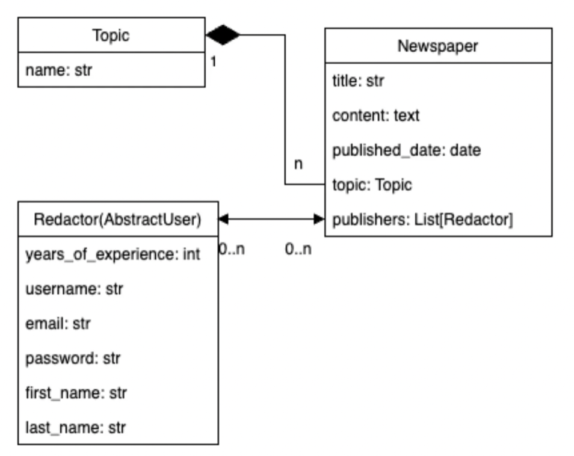

# Newspaper Agency

## Project overview

As a chief in the newspaper agency, working with great team of Redactors, I decided to create website to track 
Newspapers, published by our agency, in a proper way.
For that purpose I decided to create a system for tracking Redactors, assigned to Newspapers.
So I will always know, who were the publishers of each Newspaper.

DB Structure:



## Installation

Create venv and install requirements
```
python -m venv venv
venv\Scripts\activate (on Windows)
source venv/bin/activate (on macOS)
pip install -r requirements.txt
```

## Configuration

### Environment Variables

This project uses environment variables for configuration. To set up the required variables, follow these steps:

1. Create a new `.env` file in the root directory of the project.

2. Copy the contents of the `.env_sample` file into `.env`.

3. Replace the placeholder values in the `.env` file with the actual values specific to your environment.


## Usage

- To apply migrations to the database use command:
```
python manage.py migrate
```
- To run server use command:
```
python manage.py runserver
```
- To run tests use command:
```
python manage.py test
```
